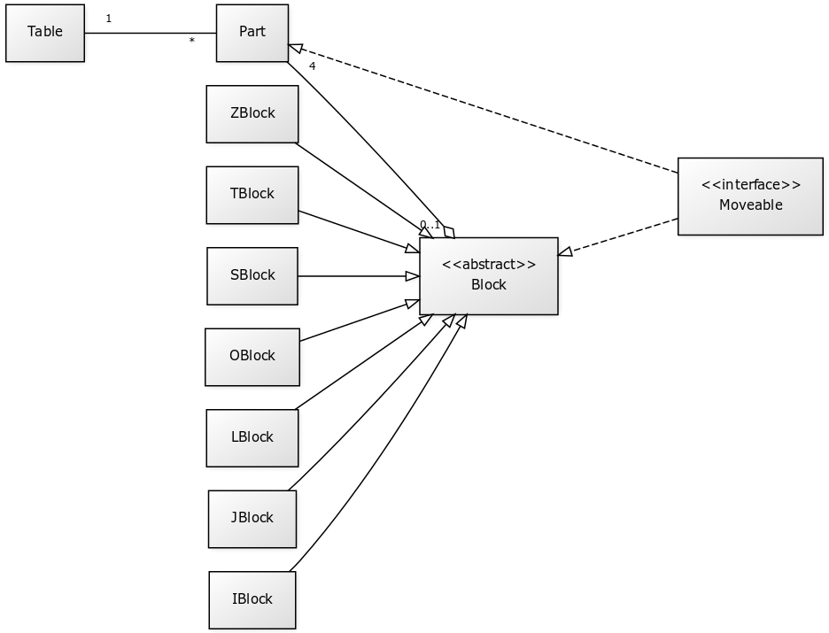

# Aihemäärittely

**Aihe:** Reaaliaikainen peli Tetris. Toteututaan graafisen käyttöliittymän ja näppäimistön avulla toimiva peli, jossa pelaajan tavoitteena on siirrellä pelin konstruoimia palikoita niin, etteivät ne kosketa peliruuden ylälaitaa. Kun palikat saadaan aseteltua niin, että niiden sisältämät palaset muodostavat yhtenäisen rivin, rivi tuhoutuu ja pelaaja saa pisteitä. Palikoiden putoamisnopeutta lisäämällä voidaan peliin luoda useita haasteellisuustasoja.

**Käyttäjät:** Satunnaiset pelaajat. Todennäköisimpiä käyttäjiä ovat kurssin opiskelijat ja ohjaajat sekä satunnaiset ohjelmaa testaavat ystävät.

**Kaikkien käyttäjien toiminnot:** 
* Pelin vaikeustason säätäminen
* Pelin aloittaminen
* Pelin lopetus
* Pelipalikoiden siirtely
* Pelipalikoiden rotaatio

**Mahdollisia lisätoimintoja mikäli aikaa riittää:**
* Pelin tauotus mahdollisuus
* Pelinäppäinten muuttaminen
* Värimaailman säätäminen
* Lisävaikeustaso, jossa yllätyksiä

#Luokkakaavio

#Sekvenssikaaviot:

![Palikan siirto] (Sekvenssikaaviot/Palikan siirtäminen oikealle.png)
![Palikan kääntö] (Sekvenssikaaviot/Palikan kääntäminen myötäpäivään.png)
![BlockLogic] (Sekvenssikaaviot/BlockLogic.canrotateRight.png)
